# Terraform CI/CD Pipeline with GitHub Actions


A fully automated infrastructure pipeline that deploys an EC2 instance with Nginx web server on every push to GitHub. This project demonstrates Infrastructure as Code (IaC) best practices with zero manual intervention.

## 🚀 Features

- ✅ **Fully Automated**: Push code → GitHub Actions → Terraform apply → EC2 running → Website live
- ✅ **Idempotent**: Repeated runs don't cause errors or duplicate resources
- ✅ **Security**: Configured security groups with HTTP, HTTPS, and SSH access
- ✅ **Web Server**: Nginx automatically installed and configured with a sample website
- ✅ **Status Feedback**: Clear status reporting in GitHub Actions for each step
- ✅ **Infrastructure as Code**: All infrastructure defined in version-controlled Terraform files

## 📋 Prerequisites

Before you begin, ensure you have:

1. **AWS Account** with appropriate permissions to create:
   - EC2 instances
   - Security groups
   - VPC resources

2. **GitHub Account** and a repository for this code

3. **AWS IAM User** with programmatic access (Access Key ID and Secret Access Key)

## 🛠️ Setup Instructions

### Step 1: Clone or Push to GitHub

```bash
# Initialize git repository (if not already done)
git init

# Add all files
git add .

# Commit changes
git commit -m "Initial Terraform CI/CD setup"

# Add your GitHub repository as remote
git remote add origin https://github.com/YOUR_USERNAME/YOUR_REPO.git

# Push to GitHub
git push -u origin main
```

### Step 2: Configure GitHub Secrets

1. Go to your GitHub repository
2. Navigate to **Settings** → **Secrets and variables** → **Actions**
3. Click **New repository secret**
4. Add the following secrets:

   | Secret Name | Value |
   |-------------|-------|
   | `AWS_ACCESS_KEY_ID` | Your AWS access key ID |
   | `AWS_SECRET_ACCESS_KEY` | Your AWS secret access key |

> [!WARNING]
> Never commit AWS credentials to your repository. Always use GitHub Secrets.

### Step 3: Configure Environment (Optional)

1. Go to **Settings** → **Environments**
2. Create a new environment named `production`
3. Add protection rules if desired (e.g., required reviewers)

### Step 4: Trigger Deployment

The pipeline automatically triggers on:
- Push to `main` or `master` branch
- Pull requests to `main` or `master` branch

To trigger your first deployment:

```bash
# Make a change (or just trigger a commit)
git commit --allow-empty -m "Trigger deployment"
git push
```

### Step 5: Monitor Deployment

1. Go to the **Actions** tab in your GitHub repository
2. Click on the running workflow
3. Monitor each step's progress
4. Once complete, find the website URL in the job summary

## 📁 Project Structure

```
teraform/
├── .github/
│   └── workflows/
│       └── terraform.yml      # GitHub Actions workflow
├── main.tf                    # Main infrastructure configuration
├── provider.tf                # Terraform and AWS provider settings
├── variables.tf               # Variable definitions
├── outputs.tf                 # Output definitions
├── terraform.tfvars           # Variable values (not committed to git)
├── .gitignore                 # Git ignore rules
└── README.md                  # This file
```

## 🔧 Configuration

### Customizing Variables

Edit `terraform.tfvars` to customize your deployment:

```hcl
aws_region     = "ap-south-1"
instance_type  = "t2.micro"
ami_id         = "ami-0f5ee92e2d63afc18"
environment    = "development"
project_name   = "terraform-web-server"

# Optional: Add SSH key for instance access
# key_name = "your-key-pair-name"

# Optional: Restrict SSH access to your IP
# ssh_cidr_blocks = ["YOUR_IP/32"]
```

### Changing Region

To deploy in a different AWS region:

1. Update `aws_region` in `terraform.tfvars`
2. Find a valid Ubuntu AMI for that region at [Ubuntu Cloud Images](https://cloud-images.ubuntu.com/locator/ec2/)
3. Update `ami_id` in `terraform.tfvars`

## 🌐 Accessing Your Website

After successful deployment:

1. Check the GitHub Actions job summary for the website URL
2. Or run locally:
   ```bash
   terraform output website_url
   ```
3. Open the URL in your browser: `http://<EC2_PUBLIC_IP>`

> [!NOTE]
> The website may take 2-3 minutes to become accessible while the EC2 instance initializes and installs Nginx.

## 🧪 Local Testing

Test your Terraform configuration locally before pushing:

```bash
# Initialize Terraform
terraform init

# Validate configuration
terraform validate

# Check formatting
terraform fmt -check

# Preview changes
terraform plan

# Apply changes (if you want to deploy locally)
terraform apply
```

## 🔄 Idempotency

This pipeline is designed to be idempotent:

- Running the pipeline multiple times with no changes will result in "No changes" from Terraform
- Terraform tracks state to ensure resources aren't duplicated
- Only actual infrastructure changes trigger resource updates

## 🧹 Cleanup

To destroy all created resources:

```bash
# Locally
terraform destroy

# Or delete resources via AWS Console
```

> [!CAUTION]
> This will permanently delete your EC2 instance and all associated resources.

## 📊 Pipeline Workflow

```mermaid
graph LR
    A[Push Code] --> B[GitHub Actions Triggered]
    B --> C[Checkout Code]
    C --> D[Configure AWS Credentials]
    D --> E[Setup Terraform]
    E --> F[Terraform Init]
    F --> G[Terraform Validate]
    G --> H[Terraform Plan]
    H --> I[Terraform Apply]
    I --> J[EC2 Instance Created]
    J --> K[Nginx Installed]
    K --> L[Website Live]
```



## 🔐 Security Considerations

- **SSH Access**: By default, SSH (port 22) is open to all IPs. Restrict this in production by setting `ssh_cidr_blocks` to your IP
- **HTTPS**: Currently only HTTP is configured. For production, add SSL/TLS certificates
- **Secrets**: AWS credentials are stored as GitHub Secrets, never in code
- **State Files**: State files are local. For production, use remote state (S3 + DynamoDB)

## 🐛 Troubleshooting

### Pipeline Fails at "Configure AWS Credentials"
- Verify GitHub Secrets are set correctly
- Check IAM user has necessary permissions

### Pipeline Fails at "Terraform Apply"
- Check AWS account limits (EC2 instance limits)
- Verify AMI ID is valid for your region
- Check VPC and subnet availability

### Website Not Accessible
- Wait 2-3 minutes for instance initialization
- Check security group allows inbound traffic on port 80
- Verify instance is running in AWS Console

### "Resource Already Exists" Error
- Terraform state may be out of sync
- Check if resources exist in AWS Console
- Consider importing existing resources or destroying and recreating

## 📚 Additional Resources

- [Terraform Documentation](https://www.terraform.io/docs)
- [AWS EC2 Documentation](https://docs.aws.amazon.com/ec2/)
- [GitHub Actions Documentation](https://docs.github.com/en/actions)
- [Nginx Documentation](https://nginx.org/en/docs/)

## 📝 License

This project is open source and available under the MIT License.

## 🤝 Contributing

Contributions, issues, and feature requests are welcome!

---

**Built with ❤️ using Terraform, AWS, and GitHub Actions**
